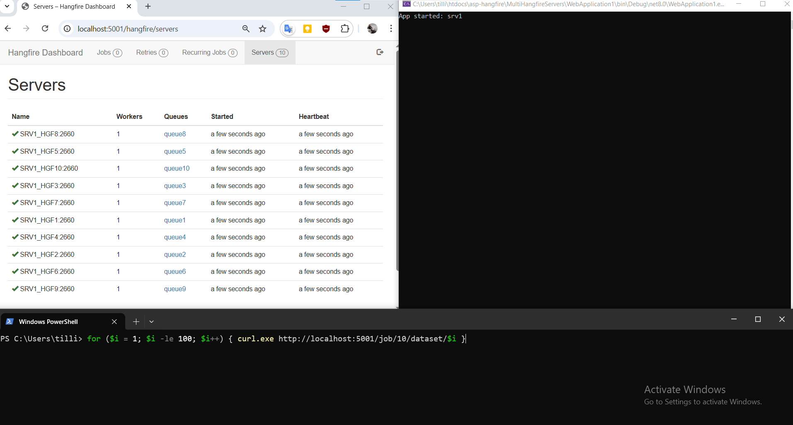
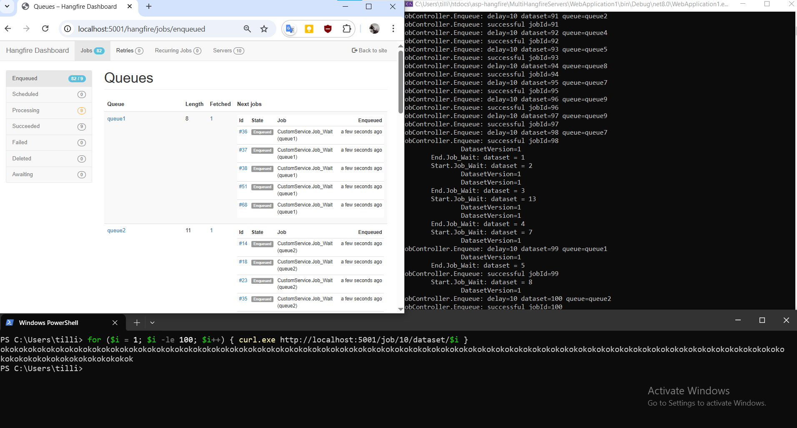
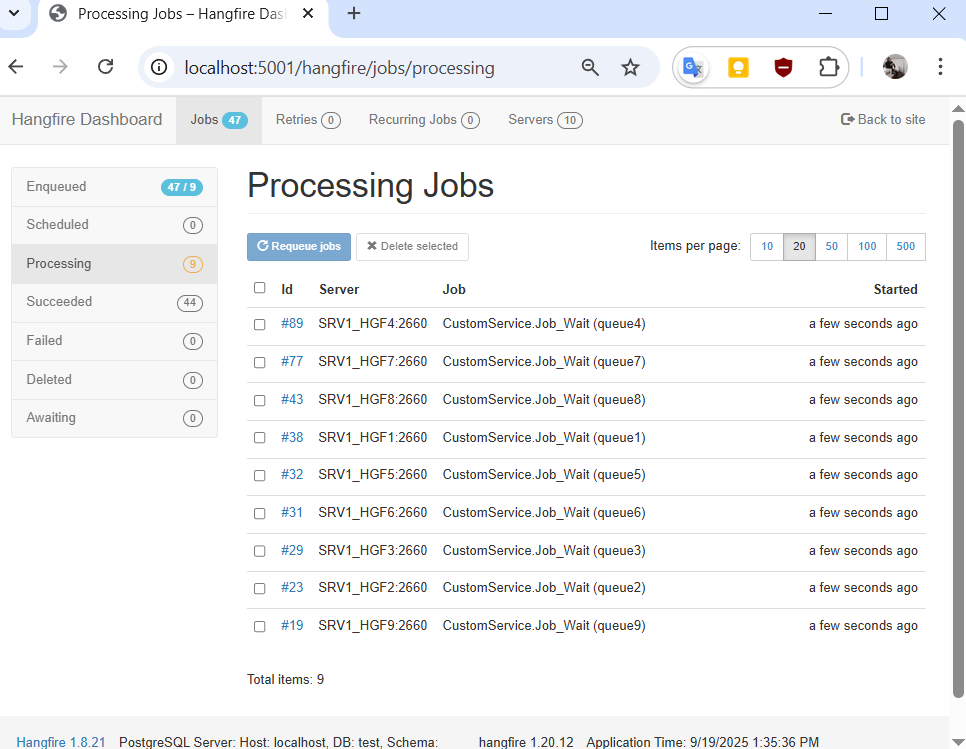
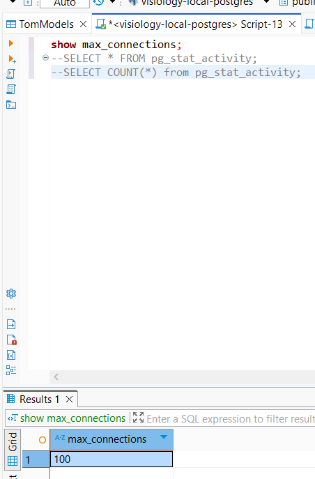
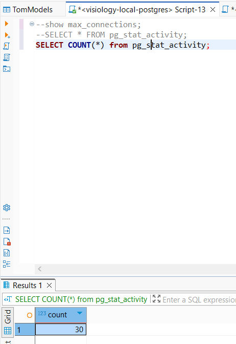
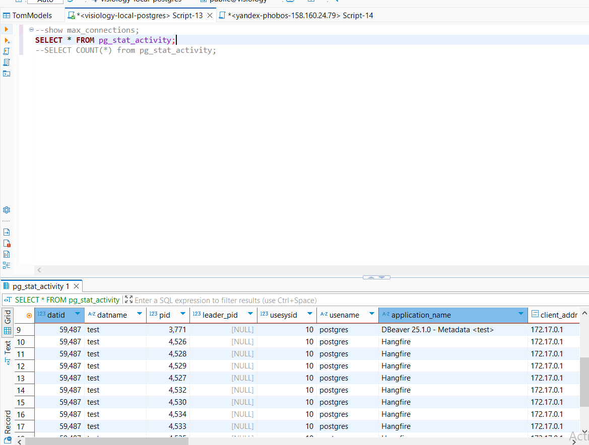

# проблема
присутвует N источников данных (dataset), которые необходимо обновлять таким образом, чтобы обновление одного источника данных никак не затрагивало, не влияло и не тормозило обновления другого источника. при этом несколько обновлений по одному и тому же источнику данных должны выстраиваться в очередь. т.е. нужен паралелизм между разными источниками, но последовательность обновлений по одному источнику. необходимо реализовать с использованием Hangfire. Концептуально чтото типо kafka очередей по partitions.

# решение
- создать M Hangfire серверов по одному worker в каждом сервере. настроить каждый сервер на одну очередь. настройки происходят внутри класса HangfireService
- выставление каждой Hangfire задачи будет проходить через абстракцию над Hangfire в классе JobController.
- сами методы которые выполняются внутри Hangfire задач хранятся в CustomService. код напиисан таким образом что при невыполнение условий и каком либо сбое произойдёт Exception внутри задачи

# примеры запуска
- запуск приложения с 10 серверами по одному worker, каждый настроен на одну очередь

- постановка 100 задач по 100 разным источникам данных

- видим что в каждый момент времени обновление по разным источникам выполняются независимо

- если необходима полная паралельность - то необходимо настроить количество Hangfire серверов и очередей M = N количеству источников данных
    - если очередей меньше M < N то некоторые источники будут вставать в уже занятые очереди (очередь выбирается простым Random генератором)
    - выполнение задач обновления будет назначеными к одной очереди (sticky) и не будут прыгать из очереди в очередь при присутствие уже в конкретной очереди хотя бы одной задачи на обновление по данному источнику
    - важно учитывать что создание каждого Hangfire сервера требует 4 подключений к базе данных . необходимо увеличивать лимит подключений в настроках бд при необходимости 
        - просмотреть все активные подключения можно в 